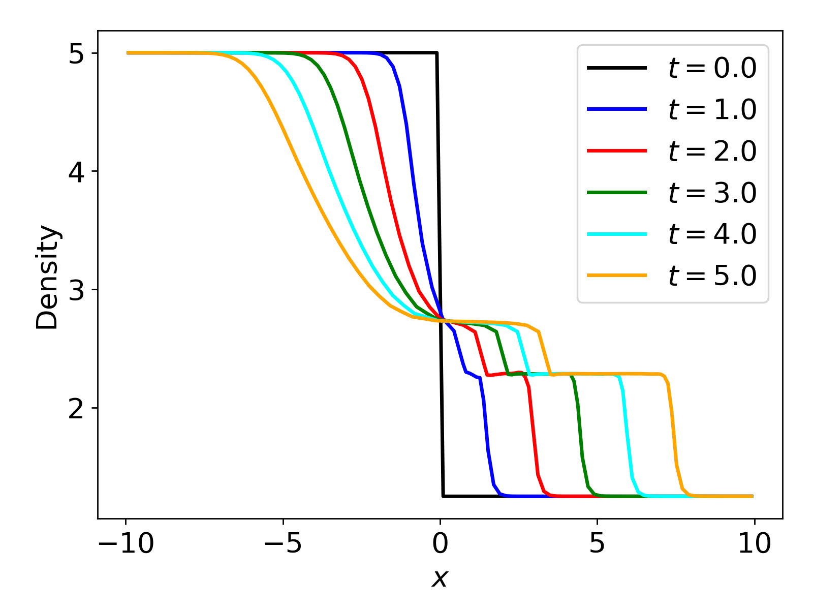

.. _Session5:

************************************************************************************
Session 5. Running simulation and analyzing data
************************************************************************************

1. Running simulation
================================================

Let's run the simulation for the shock tube test. Make sure that you still have the same environmental modules loaded as you did to compile. Because the domain is 1D, only single cpu is allowed to use. Let's run using the following line,

.. code-block:: console

   $ mpirun -n 1 ./Arepo param.txt

If the simulation begins properly, you should see this AREPO logo,

.. code-block:: console
 
   $    __    ____  ____  ____  _____
   $   /__\  (  _ \( ___)(  _ \(  _  )
   $  /(__)\  )   / )__)  )___/ )(_)(
   $ (__)(__)(_)\_)(____)(__)  (_____)

   $ ....
   
   

2. Analyzing data
================================================

A script which reads the output file and makes a line plot is included in the directory (``plot_shock_tube.py`` or ``plot_shock_tube.ipynb``). First, let's make sure that we have loaded the following modules (anaconda3 and gsl). If not, please load those using the following lines,

.. code-block:: console

   $ module load anaconda3 gsl
   
Then open the Jupyter notebook file,

.. code-block:: console

   $ jupyter notebook --no-browser --port <PORT>

and execute ``plot_shock_tube.ipynb`` or simply execute the python script,
 
.. code-block:: console

   $ python3 plot_shock_tube.py
   
you can get this image showing the evolution of the shock,

Detailed explanations for the python script will be given during the session.

