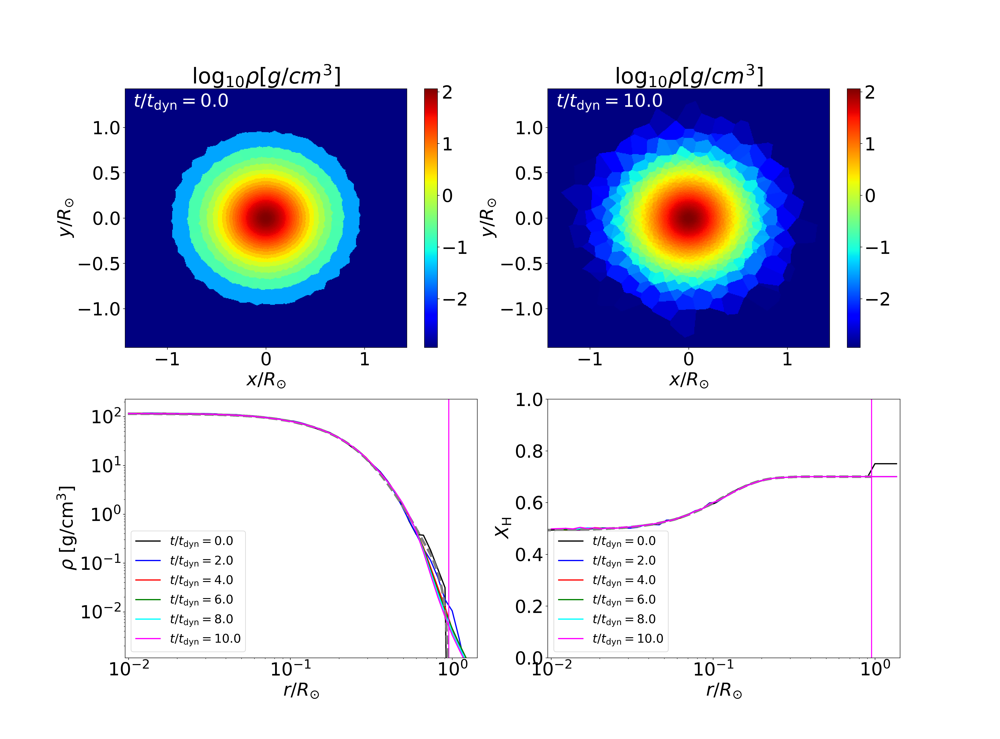

.. _Session6:

************************************************************************************
Session 6. Practice 1 - relaxation of main-sequence star
************************************************************************************

1. Overview
==================================
A python script for making a single main-sequence star can be found in ``run/Star_relaxation/Creating_IC``. In the directory, you can find the following files,

.. code-block:: console

   $ MESAmodel  helm_table.dat  ic_MS.py  module.py    param_config_sample  snapshot_single.py  species55.txt

- ``MESAmodel`` contains MESA models that will be mapped into a 3D domain. You can see two stellar models, one for a 0.3Msol star (``MESA_0.3Msol_Z0.020_H0.69.data``) and one for a 1Msol star (``MESA_1Msol_Z0.02_H0.5.data``). The files contain a table with each column having a key quantity necessary for mapping (e.g., density, internal energy, radius and so on). The file can be in any format as long as those quantities are properly read in ``ic_MS.py``.

- ``helm_table.dat`` and ``species55.txt`` are files for the Helmholtz EOS which will be used for relaxing the star.

- ``ic_MS.py`` is a python script which creates the initial condition files and puts them in a stage directory.

- ``module.py`` contains several python functions that are used to make the initial condition files and creating plots.

- ``param_config_sample`` constains sample ``param.txt`` and ``Config.sh`` which will be copied to the stage directory.

- ``snapshot_single.py`` is a python script in which output data are read to make a plot.

2. Creating 3D star
==================================

Because ``ic_MS.py`` is written to make initial condition files and put all the necessary files in a new directory authomatically, creating a 3D star is really easy. What you need to do is,

.. code-block:: console

   $ python3 ic_MS.py
   
then you can see the following (or similar) messages on display,

.. code-block:: console

   $ python3 ic_MS.py
   $ [Stellar info]
   $ MESAmodel MESAmodel/MESA_1Msol_Z0.02_H0.5.data
   $ Mass : 1.000 Msol
   $ Radius: 0.952 Rsol
   $ Core H fraction: 4.921e-01
   $ Core He fraction: 4.873e-01
   $ Total mass: 0.999703 solar masses
   $ Using 25000 particles of mass 7.95364e+28 (3.99881e-05 solar masses)
   $ volcell=5.42806e+29, volboxcell=7.0982e+31
   $ volcell=5.42806e+30, volboxcell=7.0982e+31, np=192
   $ volcell=5.42806e+31, volboxcell=7.0982e+31, np=108
   $ Added 3980 box cells.
   $ Created 29288 particles.
   $ Writing gadget file:  IC.hdf5
   $ Done.
   $ TimeMax: 14799.19175664247
   $ TimeBetSnapshot: 1479.9191756642472
   $ BoxSize: 662474960051.9448
   $ MESA model path: MESAmodel/MESA_1Msol_Z0.02_H0.5.data
   $ move files to  ../MS_relaxation_1.0msun
   
This means all the initial condition files have been moved to ``../MS_relaxation_1.0msun`` so you just need to go to that directory and run a simulation. However, what is really important is to know what is written in ``ic_MS.py`` and understand how it works so that you can creat your own script or modify the script specific for your own project.

Now let's see how the initial condition files are made in ``ic_MS.py``.

3. Compiling
==================================

As we did before, we first load the environment modules

.. code-block:: console

   $ source /usr/common/appl/modules-tcl/init/sh
   $ module purge
   $ module load mpich/3.3.6
   $ module load fftw-mpich/3.3.6
   $ module load gsl
   $ module load hdf5/1.8.18

and go to the top level of the AREPO directory (``<path_to_AREPO>/AREPO/``) and compile using the following line,

.. code-block:: console

   $ make CONFIG=./run/Star_relaxation/MS_relaxation_1.0msun/Config.sh BUILD_DIR=./run/Star_relaxation/MS_relaxation_1.0msun/build EXEC=./run/Star_relaxation/MS_relaxation_1.0msun/Arepo

4. Running
==================================

We go to the stage directory (``<path_to_AREPO>/AREPO/run/Star_relaxation/MS_relaxation_1.0msun/``) and run using the following command,

.. code-block:: console

   $ mpirun -n 10 ./Arepo param.txt

5. Analyzing
==================================

To execute the python script, use the command line,

.. code-block:: console

   $ python3 snapshot_single.py
   
or you can open a jupyter notebook file,

.. code-block:: console

   $ jupyter notebook --no-browser --port <PORT>
   
then you will see the following messages:

.. code-block:: console

   $ [I 12:33:51.509 NotebookApp] JupyterLab extension loaded from ...
   $ [I 12:33:51.509 NotebookApp] ...
   $ To access the notebook, open this file in a browser:
   $    file://...
   $ Or copy and paste one of these URLs:
   $    http://localhost:<PORT>/?token=....
   $...
   
you can copy and paste the entire URLs starting with http://localhost:<PORT>/?token=... to your favorite browser.

Using the script, you will get the following image,

