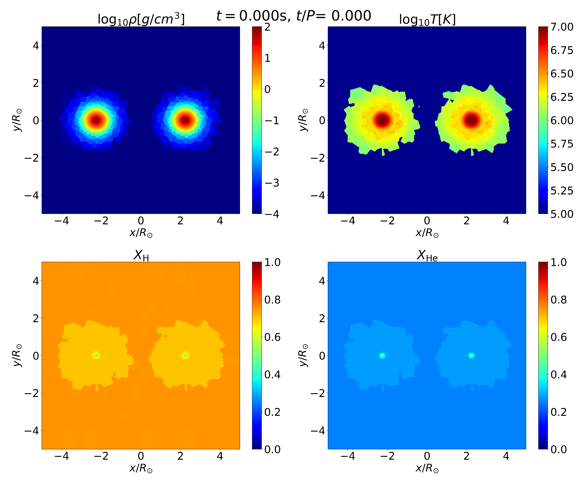

.. _Session7:

************************************************************************************
Session 7. Practice 2 - relaxation of binary star
************************************************************************************

1. Overview
==================================
A python script for making a binary star can be found in ``run/Binary_relaxation/Creating_IC``. In the directory, you can find the following files,

.. code-block:: console

   $ helm_table.dat  ic_binary.py  module.py    param_config_sample  snapshot_binary.py  species55.txt
   
Now we will create a binary consisting of two stars that we relaxed in the previous section

2. Creating 3D binary star
==================================

Like ``ic_MS.py``, ``ic_binary.py`` is written such that it generates initial condition files and puts all the necessary files in a new directory authomatically. You just need to make sure that ``path_to_single_relaxed_star`` is properly set to one of the output files from the simulation for the single star relaxation.

.. code-block:: console

   $ path_to_single_relaxed_star = "../../Star_relaxation/MS_relaxation_1.0msun/output/snapshot_010.hdf5"

The semimajor axis and eccentricity of the binary are set with the following parameters,

.. code-block:: console

   $ ecc = 0.5

   $ semi = 3.0 * unit_dist

With that, you can generate the initial condition files using the following command,
 
.. code-block:: console

   $ python3 ic_binary.py
   
then you can see the following (or similar) messages on display,

.. code-block:: console

   $ python3 ic_binary.py
   $ [BINARY INFO]
   $ m1 1.035e+00 Msun 1.035e+00 Msun
   $ semimajor axis [rsun] 3.000
   $ ecc                   0.500
   $ total particle 26376 + 26376 = 52752
   $ 52752 particles found.
   $ Building grid with 16 x 16 x 16 cells.
   $ Created 3438 particles to fill grid.
   $ 56190 particles found.
   $ Building grid with 16 x 16 x 16 cells.
   $ Created 2698 particles to fill grid.
   $ 58888 particles found.
   $ Building grid with 16 x 16 x 16 cells.
   $ Created 3096 particles to fill grid.
   $ Writing gadget file:  IC.hdf5
   $ Done.
   $ move files to ../binary_relaxation_1.0Msol_1.0Msol_a3.0_e0.5

3. Compiling
==================================

As we did before, we first load the environment modules,

.. code-block:: console

   $ source /usr/common/appl/modules-tcl/init/sh
   $ module purge
   $ module load mpich/3.3.6
   $ module load fftw-mpich/3.3.6
   $ module load gsl
   $ module load hdf5/1.8.18

and go to the top level of the AREPO directory (``<path_to_AREPO>/AREPO/``) and compile using the following line,

.. code-block:: console

   $ make CONFIG=./run/Binary_relaxation/binary_relaxation_1.0Msol_1.0Msol_a3.0_e0.5/Config.sh BUILD_DIR=./run/Binary_relaxation/binary_relaxation_1.0Msol_1.0Msol_a3.0_e0.5/build EXEC=./run/Binary_relaxation/binary_relaxation_1.0Msol_1.0Msol_a3.0_e0.5/Arepo

4. Running
==================================

Now we go to the stage directory (``<path_to_AREPO>/AREPO/run/Binary_relaxation/binary_relaxation_1.0Msol_1.0Msol_a3.0_e0.5/``) and run using the following command,

.. code-block:: console

   $ mpirun -n 10 ./Arepo param.txt

5. Analyzing
==================================

To execute the python script, use the command line,

.. code-block:: console

   $ python3 snapshot_binary.py

then, you will get a series of images, for example,

           ../images/binary_star_relaxation_18437.png
           ../images/binary_star_relaxation_31093.png

